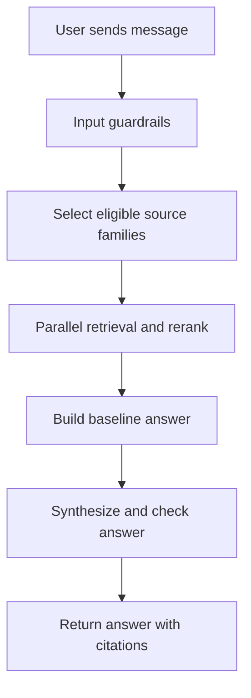

# Enterprise Supply Chain Agentic Platform

Hybrid retrieval assistant for a synthetic `abc.co` supply-chain operations dataset.

The project answers operational questions by retrieving evidence from Markdown SOPs, an inventory CSV, and a lightweight knowledge graph, then synthesizing a grounded answer. The UI is a streaming chat app. The backend is a FastAPI service backed by LangGraph, OpenRouter, Chroma, pandas, NetworkX, and NeMo Guardrails where those dependencies are available.

## Quick Start

Use the repo helper scripts for local setup and launch:

```bash
./setup.sh    # create .venv, install Python + frontend deps
./start.sh    # run FastAPI backend and React frontend together
```

1. Run `./setup.sh` once. It installs `uv` if needed, creates `.venv`, installs `requirements.txt`, and runs `npm install` in `frontend/`.
2. Create a `.env` file in the project root with at least `OPENROUTER_API_KEY` (see [Environment](#environment)).
3. Run `./start.sh` to start both services. Default URLs:
   - Backend: `http://127.0.0.1:8000`
   - Frontend: `http://localhost:3000`

Press `Ctrl+C` in the terminal to stop both processes. See [Setup](#setup) and [Run The App](#run-the-app) for details and manual alternatives.

## What This Project Does

- Answers questions about shipment escalation, procurement approvals, inventory KPIs, customer communication, and branch inventory.
- Grounds answers in files under `dataset/` instead of open-ended web or model knowledge.
- Uses cheap source eligibility to decide which retrievers to run, then fetches eligible sources in parallel and reranks document chunks before synthesis.
- Lets the chat model classify which retrieved source families matter inside the same final answer call, with no separate LLM routing step.
- Builds citations from source file names, section paths, and line ranges.
- Uses deterministic fallbacks when semantic retrieval, reranking, NeMo, GLiNER, or model calls are unavailable.
- Streams backend progress to the React chat UI: safety check, source selection and retrieval, baseline answer, drafting, groundedness check, and final answer.

## Main Components

- `setup.sh`: One-time local bootstrap. Creates `.venv`, installs Python dependencies with `uv`, and installs frontend packages.
- `start.sh`: Starts the FastAPI backend and Vite frontend together. Loads `.env`, activates `.venv`, and stops both on `Ctrl+C`.
- `src/api.py`: FastAPI app. Owns `/chat`, `/chat/stream`, and in-memory sessions.
- `src/llm_interface.py`: LangGraph workflow. Runs input guardrails, parallel retrieval, baseline answer generation, LLM synthesis with integrated source selection, output guardrails, and retries.
- `src/retriever.py`: Parallel retrieval orchestrator and document retriever. Uses source eligibility, OpenRouter embeddings, Chroma persistence, OpenRouter rerank, and lexical fallback.
- `src/question_router.py`: Legacy heuristic router kept for eval and the deterministic `answer_question()` path.
- `src/rag_answerer.py`: Deterministic answer formatter. Turns retrieved bundles into readable answers before any LLM rewrite.
- `src/structured_data.py`: pandas operations over `dataset/inventory_branch_snapshot.csv`.
- `knowledge_graph/`: NetworkX graph build, graph query helpers, and PyVis visualization tools.
- `guardrails/config/`: NeMo Guardrails config and rail files.
- `frontend/`: Vite + React chat frontend using `@assistant-ui/react`.
- `eval/evaluate.py`: Evaluation runner for the dataset questions.

## Runtime Flow



The important part is the separation between retrieval and generation. The system first gathers eligible evidence in parallel, builds a grounded baseline from known data, then lets the chat model classify which source families matter and draft the final answer in one call. The model receives the baseline plus retrieved context, graph facts, structured result data, warnings, and required citations.

## Data Sources

The assistant only knows the synthetic abc.co dataset in this repository.

- `dataset/company_backdrop.md`: company and branch context.
- `dataset/shipment_escalation_sop.md`: delay severity, escalation, service credit, and audit rules.
- `dataset/procurement_approval_policy.md`: approval thresholds, quote rules, emergency procurement.
- `dataset/inventory_kpi_guide.md`: inventory aging, reorder level, slow-moving inventory, stockout risk, and formulas.
- `dataset/customer_communication_playbook.md`: customer-facing tone, refunds, credits, and allowed language.
- `dataset/inventory_branch_snapshot.csv`: branch, SKU, stock, sales, supplier, lead time, and aging data.
- `dataset/eval_questions.json`: regression questions used by `eval/evaluate.py`.

Additional Markdown or text files can be placed in `dataset/knowledge_docs/`. `src.config.get_markdown_docs()` includes those files after the built-in dataset docs.

## Source Families And Route Labels

The chat workflow does not pick a single route before retrieval. Instead:

1. `eligible_sources_for_question()` decides which retrievers are worth running: `docs`, `graph`, and/or `structured_csv`.
2. Eligible retrievers run in parallel through `retrieve_parallel_context()`.
3. Document chunks are reranked and trimmed.
4. The final LLM call classifies which retrieved source families are relevant and answers from that evidence only.
5. `_route_from_evidence()` derives a route label from what was actually retrieved. This label is metadata for the UI and eval, not the decision maker.

Common route labels:

- `rag_policy`: answer grounded mainly in Markdown chunks.
- `graph_lookup`: answer grounded mainly in graph facts.
- `structured_data`: answer grounded mainly in CSV computation.
- `hybrid`: graph facts plus document support and/or CSV evidence.
- `ambiguous`: questions missing required inputs, such as purchase amount or requester role.
- `guardrail`: prompt-injection attempts or known security test artifact questions.
- `unsupported`: no eligible sources or no retrieved evidence.

The legacy `route_question()` helper in `src/question_router.py` still exists for the deterministic `answer_question()` path and eval tooling, but the FastAPI chat workflow uses the parallel retrieval path instead.

## How A Chat Request Runs

1. The frontend calls `POST /api/chat/stream` through `frontend/src/lib/api.ts`.
2. Vite proxies `/api` to the FastAPI backend during local development.
3. `src/api.py` creates or loads an in-memory session.
4. Recent safe session messages are passed into `answer_with_llm_events()`.
5. `check_input_guardrails()` blocks prompt injection, unsupported sensitive topics, and likely PII.
6. `retrieve_parallel_context()` selects eligible source families and fetches them concurrently:
   - Docs: `DocumentRetriever.search()` with optional graph query expansion.
   - Graph: `knowledge_graph.graph_queries.graph_facts_for_question()`.
   - CSV: `answer_structured_question()` when inventory computation terms are present.
7. Document chunks are reranked and merged with graph and CSV evidence into one `RetrievalBundle`.
8. `answer_from_bundle()` builds a deterministic baseline answer.
9. For normal data routes, the OpenRouter chat model drafts the final answer from the baseline and context, classifying which source families to use in the same call.
10. `check_output_guardrails()` scores context relevance and groundedness.
11. If quality is too low and retries are enabled, the model rewrites the answer using stricter instructions.
12. The API streams answer deltas and ends with route, confidence, citations, warnings, model, and guardrail metadata.
13. The session stores the turn unless the result was blocked by guardrails.

## Retrieval Path

`DocumentRetriever` loads Markdown through `src/ingest_docs.py`.

- Each Markdown heading becomes a section-aware `SourceChunk`.
- A chunk keeps source file, heading, section path, start line, end line, document id, score, and security-artifact flag.
- The prompt-injection appendix inside `shipment_escalation_sop.md` is marked as a security test artifact.

When `OPENROUTER_API_KEY` is available:

1. Document chunks are embedded with `OPENROUTER_EMBEDDING_MODEL`.
2. Embeddings are stored in Chroma at `.chroma/abc_ops_docs`.
3. `.chroma/abc_ops_docs/index_manifest.json` records chunk count, content hash, embedding model, and embedding dimension.
4. If chunks or embedding model change, the Chroma collection is rebuilt.
5. User questions are embedded with the same model.
6. Chroma returns candidate chunks.
7. OpenRouter rerank sorts candidates with `OPENROUTER_RERANK_MODEL`.

When semantic retrieval cannot start, the retriever uses lexical scoring:

- It tokenizes the question and section text.
- It scores overlap between query tokens and chunk tokens.
- It adds section-specific boosts for known policy sections, such as approval thresholds, escalation timelines, reorder level, and customer refund rules.
- If semantic query embedding fails at search time, it falls back to lexical scoring for that request.

## Knowledge Graph Path

The knowledge graph is stored at `knowledge_graph/graph.json`.

- `knowledge_graph/build_graph.py` creates a NetworkX `MultiDiGraph`.
- `knowledge_graph/kg_from_docs.py` adds policy and SOP relationships.
- `knowledge_graph/kg_from_csv.py` adds SKU, branch, category, supplier, and inventory relationships from the CSV.
- `knowledge_graph/graph_queries.py` reads the graph and returns `GraphFact` objects.

Graph helpers handle common enterprise questions:

- `find_procurement_approver(amount_inr)`: maps amount thresholds to approvers.
- `find_delay_escalation(delay_hours)`: maps delay duration to severity and escalation facts.
- `find_kpi_relationship(kpi_name)`: returns KPI formulas, columns, and related facts.
- `find_sku_relationship(sku)`: returns branch, category, supplier, and SKU graph edges.
- `expand_query_with_graph(question)`: appends graph terms to a document query so retrieval finds the supporting SOP sections.

## Structured Inventory Path

CSV questions do not need vector search. They run deterministic pandas operations in `src/structured_data.py`.

Supported operations:

- `branch_sales_totals`: branch with highest total `sales_last_30_days`.
- `average_aging`: average `aging_days` across all rows.
- `top_aging_skus`: top SKUs by `aging_days`.
- `skus_below_reorder`: rows where `stock_units < reorder_level`.
- `branch_average_aging`: branch with highest average aging.
- `supplier_average_lead_times`: suppliers with longest average lead time.
- `slow_moving_inventory`: `aging_days > 60` and `sales_last_30_days < 20`.
- `dead_stock_candidates`: `aging_days > 120` and zero sales.
- `stockout_risk_items`: `stock_units <= reorder_level`.

The response cites `inventory_branch_snapshot.csv` instead of pretending a model derived the numbers.

## Guardrails

There are three guardrail layers. Full detail: [docs/04-guardrails-and-grounding.md](docs/04-guardrails-and-grounding.md).

- Pre-retrieval guardrails: `detect_guardrail_route()` catches prompt-injection patterns and unsupported sensitive requests before retrieval.
- Input guardrails: `check_input_guardrails()` checks prompt injection, tool/system prompt probing, likely PII, and unsupported topics.
- Output guardrails: `check_output_guardrails()` scores context relevance and groundedness, detects hallucinated facts, and can trigger one rewrite retry before refusing an ungrounded answer.

Optional integrations:

- NeMo Guardrails loads config from `guardrails/config/`.
- GLiNER can be used for PII extraction through `GLINER_SERVER_ENDPOINT`.
- OpenRouter can act as a guardrail judge when `OPENROUTER_GUARDRAIL_JUDGE_ENABLED=true`.

Fallback behavior:

- If NeMo is missing or disabled, deterministic checks still run.
- If GLiNER is unavailable, regex PII checks still run.
- If the OpenRouter guardrail judge is disabled or fails, local heuristic scoring still runs.
- If output quality is below `GUARDRAIL_MIN_QUALITY_SCORE`, the system can retry synthesis up to `GUARDRAIL_QUALITY_MAX_RETRIES`.

## Sessions And Streaming

Sessions are stored in memory in `src/session.py`.

- Session ids are 16-character hex strings.
- A maximum of 20 turns are kept in context.
- Guardrail-blocked turns are shown to the user but excluded from future model context.
- Sessions disappear when the backend process restarts.

Streaming events sent by `/chat/stream`:

- `session`: created or active session id.
- `thinking`: current backend phase.
- `answer_delta`: text chunk for the assistant answer.
- `answer_reset`: clears a draft when a groundedness retry starts.
- `done`: final answer plus route, confidence, citations, warnings, model, and guardrail scores.
- `error`: request failure.

## Frontend Flow

The React frontend is small on purpose.

- `frontend/src/App.tsx` holds the selected session and sidebar refresh state.
- `frontend/src/lib/runtime.tsx` adapts backend streaming into `@assistant-ui/react`.
- `frontend/src/lib/api.ts` wraps `/chat/stream`, `/sessions`, and session deletion.
- `frontend/src/components/Thread.tsx` renders the conversation.
- `frontend/src/components/MessageMetadata.tsx` shows route, confidence, model, warnings, and guardrail metadata.
- `frontend/src/components/CitationPanel.tsx` shows source citations.
- `frontend/src/components/Sidebar.tsx` lists in-memory sessions and starts new chats.

## Setup

Run the setup script once before first use:

```bash
./setup.sh
```

[`setup.sh`](setup.sh) creates a Python virtual environment and installs frontend dependencies.

What it does:

- Installs `uv` if it is missing.
- Creates `.venv` with Python 3.13 by default.
- Installs Python packages from `requirements.txt`.
- Runs `npm install` inside `frontend/`.
- Reminds you to create `.env` if it is missing.

You can change the Python version:

```bash
PYTHON_VERSION=3.12 ./setup.sh
```

Requirements: Node.js 20+ and npm for the frontend.

## Environment

Create a `.env` file in the project root before running [`start.sh`](start.sh).

```bash
OPENROUTER_API_KEY=sk-or-...
OPENROUTER_CHAT_MODEL=deepseek/deepseek-v4-pro
OPENROUTER_EMBEDDING_MODEL=google/gemini-embedding-2-preview
OPENROUTER_RERANK_MODEL=cohere/rerank-4-fast
OPENROUTER_GUARDRAIL_MODEL=deepseek/deepseek-v4-pro
OPENROUTER_GUARDRAIL_JUDGE_ENABLED=false
GUARDRAIL_MIN_QUALITY_SCORE=0.7
GUARDRAIL_QUALITY_MAX_RETRIES=1
NEMO_GUARDRAILS_ENABLED=true
```

Useful optional settings:

```bash
GLINER_SERVER_ENDPOINT=http://localhost:1235/v1/extract
BACKEND_HOST=127.0.0.1
BACKEND_PORT=8000
FRONTEND_PORT=3000
ANONYMIZED_TELEMETRY=false
LANGFUSE_SESSION_ID=local-dev
```

The backend can run basic deterministic paths without every optional service, but the intended chat workflow needs `OPENROUTER_API_KEY`.

## Run The App

After setup, start backend and frontend together:

```bash
./start.sh
```

[`start.sh`](start.sh) checks that `.venv` and `frontend/node_modules` exist, sources `.env`, activates the virtualenv, and launches:

- `uvicorn src.api:app --reload` on `BACKEND_HOST:BACKEND_PORT` (default `127.0.0.1:8000`)
- `npm run dev` in `frontend/` on `FRONTEND_PORT` (default `3000`)

Default URLs:

- Backend: `http://127.0.0.1:8000`
- Frontend: `http://localhost:3000`

Override ports if needed:

```bash
BACKEND_PORT=8080 FRONTEND_PORT=5173 ./start.sh
```

Run backend only:

```bash
source .venv/bin/activate
uvicorn src.api:app --reload --host 127.0.0.1 --port 8000
```

Run frontend only:

```bash
cd frontend
npm run dev -- --host 127.0.0.1 --port 3000
```

## Use The Python API

```python
from src import answer_question
from src.retriever import retrieve_parallel_context

question = "Who approves procurement requests above Rs 5,00,000 at abc.co?"

bundle = retrieve_parallel_context(question)
print(bundle.route)
print(answer_question(question).answer)
```

`retrieve_parallel_context()` is the chat retrieval path. `answer_question()` uses the legacy deterministic retrieval formatter via `retrieve_context()`. The FastAPI chat endpoints use `answer_with_llm()` or `answer_with_llm_events()`, which add model synthesis and guardrail scoring.

## Use The CLI

Ask one question:

```bash
python3 -m src.chat_cli "Which SKUs are below reorder level in the inventory snapshot?"
```

Start an interactive session:

```bash
python3 -m src.chat_cli
```

## Build And Visualize The Graph

Build `knowledge_graph/graph.json`:

```bash
python3 -m knowledge_graph.build_graph
```

Generate PyVis HTML views:

```bash
python3 -m knowledge_graph.visualize_graph --view policy_overview --open
python3 -m knowledge_graph.visualize_graph --view procurement
python3 -m knowledge_graph.visualize_graph --view sku --sku ELEC-WEBCAM-03
python3 -m knowledge_graph.visualize_graph --view branch --branch Mumbai
python3 -m knowledge_graph.visualize_graph --stats
```

HTML output is written to `knowledge_graph/viz/`.

## Ingest Additional Knowledge

Use this when you want to add a local Markdown or text file to the document set:

```bash
python3 scripts/ingest_knowledge_file.py path/to/file.md
```

The ingested file is copied into `dataset/knowledge_docs/`. The next retriever run includes it. If semantic retrieval is enabled, the Chroma manifest detects changed chunks and rebuilds the index.

## Run Evaluation

```bash
python3 eval/evaluate.py
```

The expected report for the included dataset is:

```json
{
  "passed": 25,
  "total": 25
}
```

## Run Tests

```bash
python3 -m pytest
```

Frontend typecheck and build:

```bash
cd frontend
npm run build
```

## Common Failure Modes

- `OPENROUTER_API_KEY is not configured`: add the key to `.env` or export it in the shell.
- `LangChain/LangGraph dependencies are not installed`: run `./setup.sh` or `python3 -m pip install -r requirements.txt`.
- Semantic retrieval falls back to lexical search: OpenRouter, Chroma, or rerank is unavailable. The app should still answer supported questions, but ranking may be weaker.
- NeMo or GLiNER warnings appear: optional guardrail services are unavailable. Deterministic guardrails still run.
- Sessions vanish after restart: expected. Session storage is in memory.
- Frontend cannot reach backend: check that backend is on `127.0.0.1:8000` or update the Vite proxy config.

## Project Shape

```text
.
|-- dataset/                 # Synthetic abc.co source data
|-- docs/                    # Architecture notes, dry runs, guardrails doc
|-- eval/                    # Evaluation runner
|-- frontend/                # React chat UI
|-- guardrails/              # NeMo config and rail files
|-- knowledge_graph/         # Graph build, query, and visualization code
|-- scripts/                 # Knowledge ingestion helper
|-- src/                     # Backend application code
|-- tests/                   # pytest suite
|-- setup.sh                 # Local dependency setup
`-- start.sh                 # Starts backend and frontend
```
