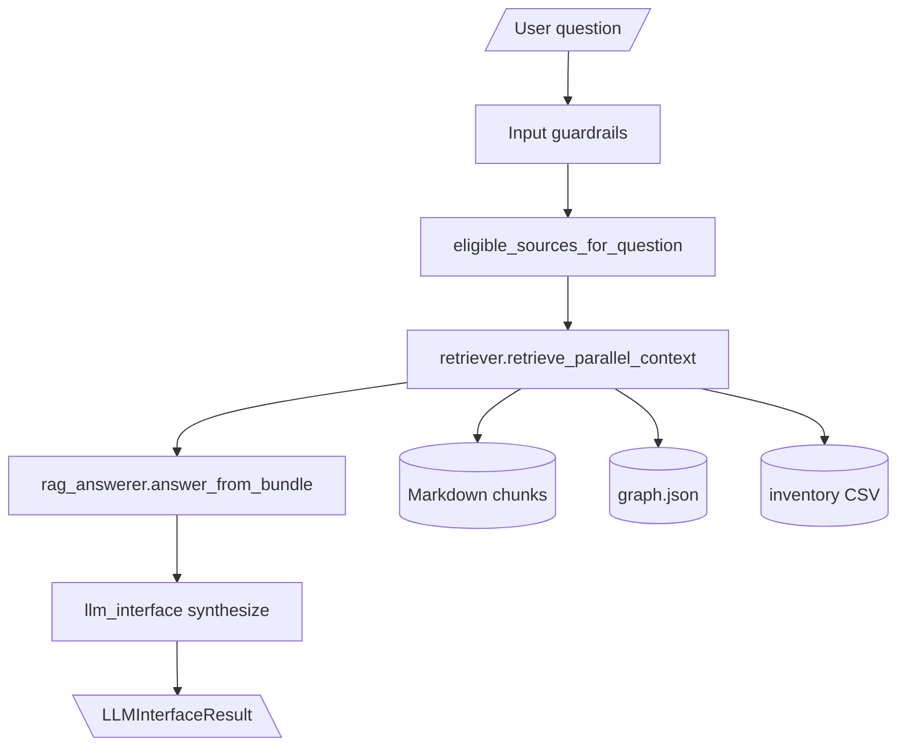
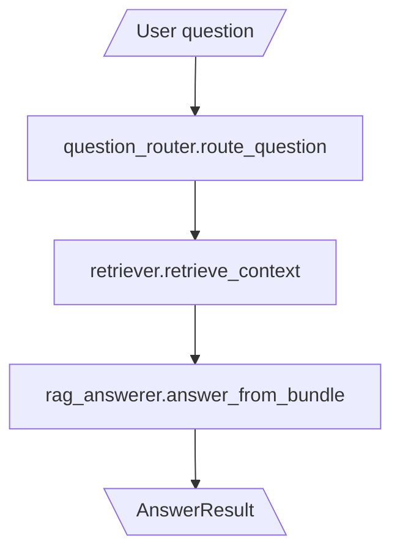
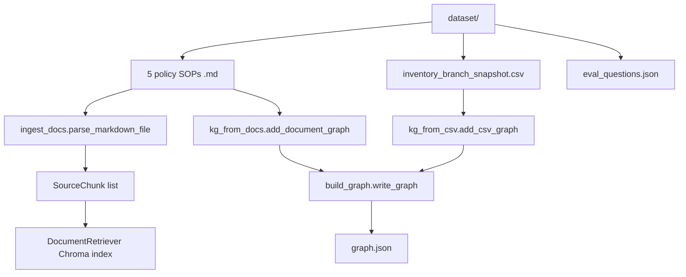
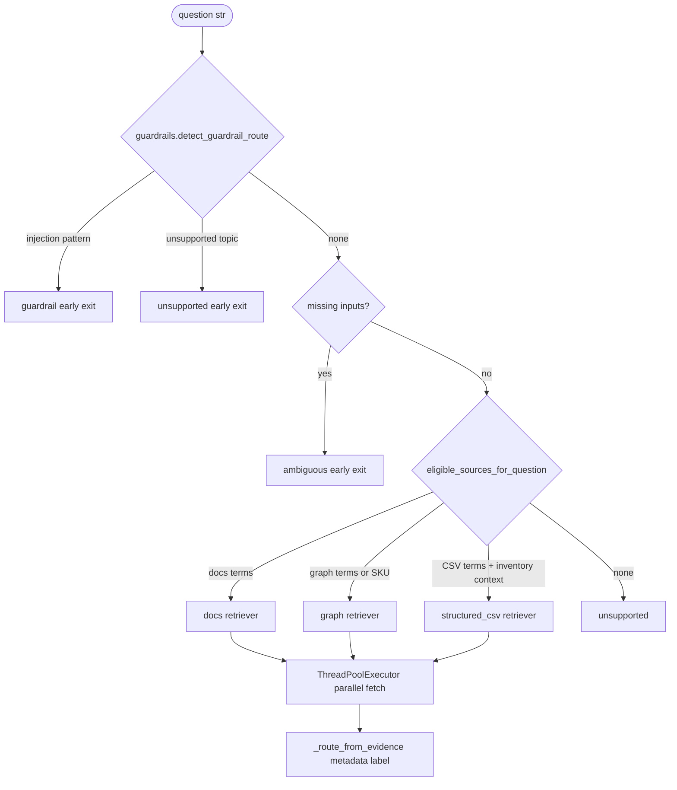
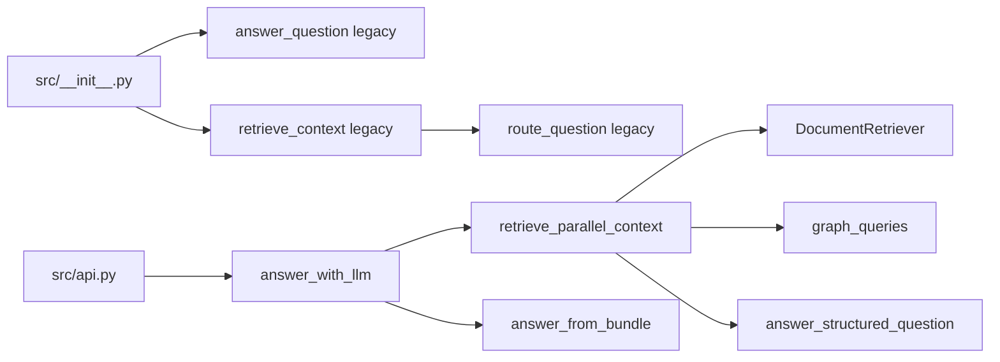

# High-Level Overview

Hybrid retrieval for abc.co ops questions. One question in, one grounded answer out.

The chat path uses parallel retrieval plus LLM synthesis. The legacy deterministic path still exists for eval and `answer_question()`.

## TL;DR

- **Source eligibility** picks candidate retrievers: docs, graph, and/or CSV.
- **Parallel retrieval** fetches eligible evidence, reranks docs, and merges one bundle.
- **Same LLM call** classifies which source families matter and writes the final answer.
- **Three data planes**: Markdown SOPs, `inventory_branch_snapshot.csv`, and `knowledge_graph/graph.json`.
- **Semantic search** (OpenRouter embed + Chroma + rerank) with lexical fallback when API keys are missing.

## System map

### Chat path (FastAPI / LangGraph)

### Legacy deterministic path

## Data sources

## Source eligibility

Cheap prefilter only. It does not choose the final route.

## Route labels

Route labels are derived from retrieved evidence, not from a pre-retrieval router in the chat path.

| Label | Meaning | Typical evidence |
|-------|---------|------------------|
| `rag_policy` | docs only | doc chunks + citations |
| `graph_lookup` | graph only | graph facts |
| `structured_data` | CSV only | pandas result dict |
| `hybrid` | multiple families | graph + docs and/or CSV |
| `ambiguous` | missing inputs | clarification prompt |
| `guardrail` | injection / artifact | refusal |
| `unsupported` | no eligible or empty evidence | out-of-scope message |

## Public API surface

> **Legend**: Cylinders = persisted data. Diamonds = guardrail or eligibility checks. Rounded = I/O boundaries.
