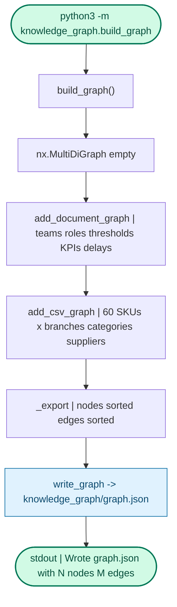
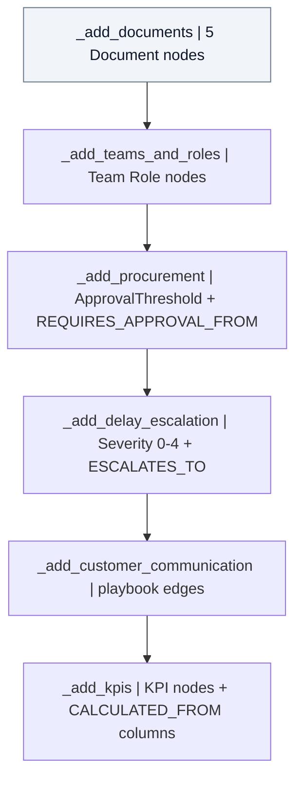
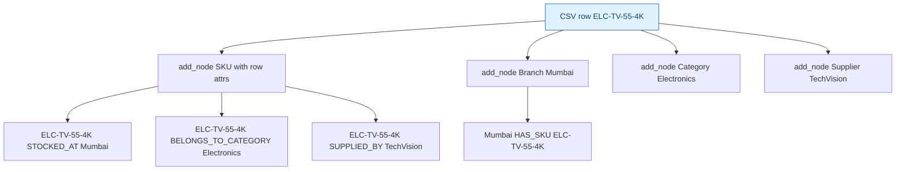
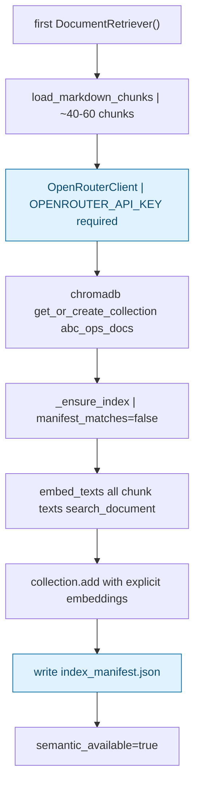
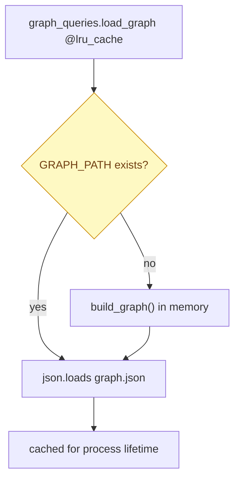
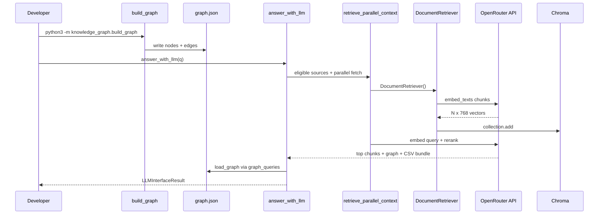
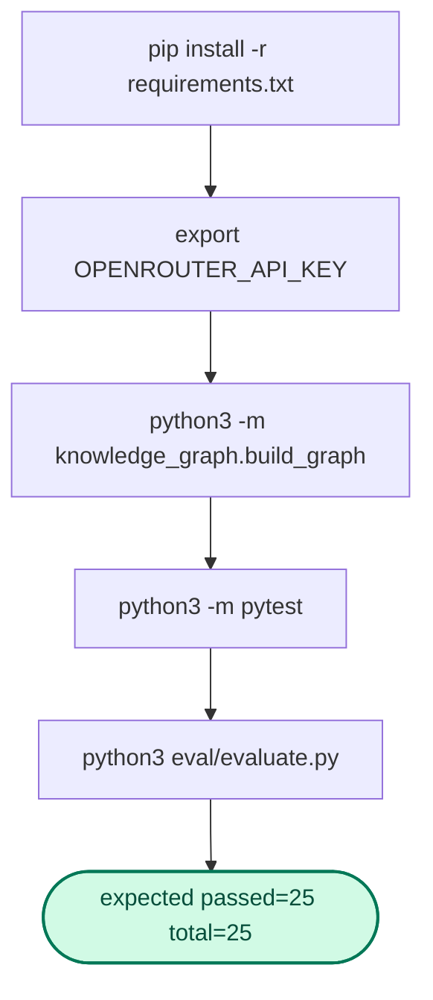

# Bootstrap Pipeline

Offline steps that populate indexes before any question hits the runtime path.

---

## Graph build

**Assumptions:** fresh clone, CSV has 60 SKU rows, 5 markdown docs present

### Document graph nodes (from `kg_from_docs.py`)

### CSV graph edges (per row)

**Dummy row:** sku=`ELC-TV-55-4K`, branch=`Mumbai`, category=`Electronics`, supplier=`TechVision`

---

## Chroma index build (lazy on first query)

**Assumptions:** first call to `DocumentRetriever()`, manifest missing

**Manifest invalidation triggers rebuild when any of these change:**

- chunk count
- content SHA256 hash
- embedding model name
- collection count mismatch

---

## Runtime lazy graph load

**Assumptions:** `graph.json` deleted, first question arrives

---

## Full cold-start sequence

---

## Install and verify

> **Legend**: Sequence diagram = cross-service I/O. Graph TD = in-process call order.
