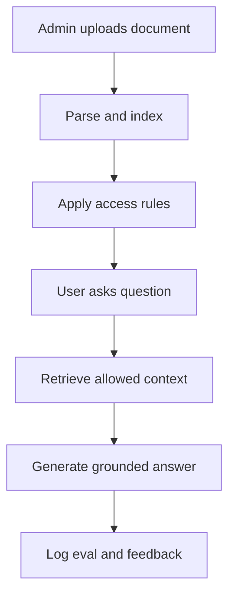

# Future Scope

This project is a strong local prototype. The next version should feel less like a demo and more like an enterprise assistant that teams can trust with real internal documents.

The roadmap focuses on five areas:

- faster context generation
- document upload from the UI
- secure user-specific retrieval
- stronger guardrails
- model improvement from eval and Langfuse data

## Target Product Direction

The current app answers from a fixed repo dataset. Future versions should support a living knowledge base:

- admins upload new policies and SOPs from the UI
- users see answers only from documents they are allowed to access
- retrieval gets faster as repeated questions and common documents are cached
- guardrails become policy-aware, user-aware, and audit-friendly
- eval traces and Langfuse logs become training and tuning data

Simple version: make the assistant faster, safer, and easier to operate.

## Future Flow

## Faster Context Generation

The current retrieval path is correct first, fast second. Future work should reduce latency without weakening grounding.

Good next steps:

- Cache repeated retrieval bundles for common questions.
- Cache embeddings for uploaded documents and stable query expansions.
- Precompute graph expansions for known entities like SKUs, suppliers, branches, teams, and policy names.
- Keep reranking, but avoid reranking the same candidate set repeatedly.
- Add background indexing so document upload does not block the user.
- Add a context budget manager that trims evidence before the LLM call based on source quality and user access.

Why it matters:

- Users notice slow first-token latency.
- Faster context means cheaper model calls.
- Smaller, cleaner context usually improves answer quality.

## Document Upload In The UI

Admins should be able to add new knowledge without touching the repo.

Suggested UI flow:

1. Admin uploads a PDF, Markdown file, CSV, or text document.
2. UI asks for document metadata: title, business area, owner, sensitivity, allowed roles.
3. Backend extracts text and chunks it.
4. System creates embeddings and updates the vector index.
5. Admin sees ingestion status and parsing warnings.
6. Document becomes available for retrieval based on access rules.

Useful metadata:

- business domain: procurement, inventory, logistics, finance, customer support
- document type: SOP, policy, playbook, dataset, contract, report
- owner team
- access level
- effective date and expiry date
- source version

This turns the app from a static demo into a small internal knowledge platform.

## Admin And User Profiles

The biggest enterprise gap is access control.

Future versions should separate users by identity, role, and document permission.

Example roles:

- Admin: upload documents, manage access, view audit logs.
- Manager: query team-level policies and operational reports.
- Finance user: access finance approvals and refund rules.
- Customer support user: access customer communication playbooks but not internal finance reports.
- Viewer: ask general questions from public internal docs only.

Retrieval must enforce access before context reaches the LLM.

Bad pattern:

- retrieve everything
- ask the LLM not to reveal restricted docs

Good pattern:

- filter documents by user permission first
- retrieve only allowed documents
- pass only allowed context to the model

This is like a library card. The assistant should not even bring restricted books to the table.

## Security-Aware Retrieval

Access control should be part of retrieval, not just the UI.

Needed pieces:

- document ACLs stored with each chunk
- user profile attached to every chat request
- retrieval filters for role, team, document owner, sensitivity, and tenant
- audit logs for which documents were retrieved
- refusal text when a user asks for a document they cannot access

Example:

Customer support asks: "What refund amount can I promise for this delayed shipment?"

Allowed:

- customer communication playbook
- shipment escalation SOP

Blocked:

- internal finance exception table
- customer compensation budget

The answer should say support cannot promise a refund without Finance approval, without leaking restricted finance data.

## Guardrail Improvements

Current guardrails handle prompt injection, PII, grounding, and basic hallucination checks. Next versions should make them more operational.

Useful upgrades:

- Add user-aware output checks: answer must respect that user's document access.
- Add document sensitivity checks: restricted sources require stricter citations and refusal rules.
- Add policy conflict detection: if two documents disagree, answer should call out the conflict instead of guessing.
- Add source freshness checks: warn when a policy is expired or superseded.
- Add stronger prompt-injection scanning for uploaded documents.
- Store guardrail decisions in audit logs with question, route label, retrieved source ids, scores, and refusal reason.

The goal is not to block more answers. The goal is to block the risky ones and explain why.

## Prompt Caching

Prompt caching can cut latency and cost once the app has repeated traffic.

Good cache candidates:

- stable system prompts
- guardrail prompts
- frequently retrieved policy context
- common entity expansions from the graph
- repeated eval questions

Cache carefully:

- include user role and document permissions in the cache key
- never share cached restricted context across users
- expire cache when documents change
- track cache hits and misses in observability

Rule of thumb: cache prompts and context only when the access boundary is clear.

## Dataset Generation From Eval And Langfuse

The project already has eval questions. Langfuse can add real interaction traces.

Future data loop:

1. Collect traces from user questions, retrieved context, final answers, guardrail scores, and citations.
2. Label failures: bad retrieval, missing citation, hallucination, wrong tone, refusal too strict, refusal too weak.
3. Convert high-signal traces into eval cases.
4. Generate synthetic variants with an LLM-as-a-judge loop.
5. Keep accepted examples in versioned datasets.
6. Run evals before changing retrieval, prompts, or models.

This gives the team a feedback engine instead of a pile of chat logs.

## Fine-Tuning And Model Improvement

Fine-tuning should come after better evals, not before.

Good training data sources:

- passed eval answers
- manually reviewed Langfuse traces
- rejected hallucination examples
- retrieval failure cases
- rewritten grounded answers after guardrail retry
- synthetic question variants judged by LLM-as-a-judge and sampled by humans

Possible fine-tuning targets:

- answer style and formatting
- citation discipline
- refusal behavior
- asking clarification questions
- choosing relevant source families from retrieved evidence

Do not fine-tune the model to memorize policies. Keep policies in retrieval. Fine-tune behavior, not facts.

## Better Admin Experience

Admin tools should make the system explain itself.

Useful screens:

- document upload and ingestion status
- chunk preview with source paths
- role and permission editor
- retrieval trace viewer
- guardrail decision viewer
- eval dashboard
- Langfuse trace review queue

The UI should answer: "Why did the assistant say this?"

## Suggested Build Order

Start with the work that reduces risk fastest.

1. Add document upload with metadata.
2. Add document ACLs and user profiles.
3. Enforce access filters before retrieval.
4. Add retrieval trace UI for admins.
5. Add prompt and context caching with permission-safe cache keys.
6. Expand guardrail logs and conflict checks.
7. Turn Langfuse traces into eval datasets.
8. Add LLM-as-a-judge assisted data generation.
9. Fine-tune behavior only after the eval suite is strong.

